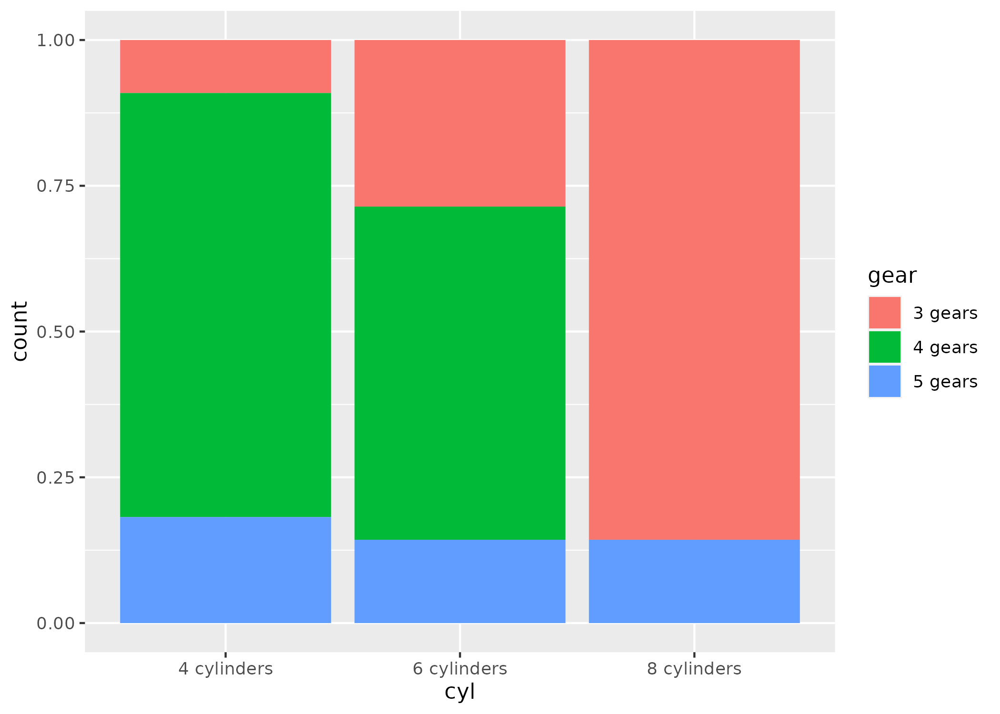

1. Using the `mtcars` data, create a barchart of the counts for each level of cylinder.

```{r}
# >
```

2. Repeat the barchart but stack the counts by gear.

```{r}
# >
```

3. Recreate this plot:



```{r}
# >
```

4. Repeat barchart #2 but set the position to "dodge".

```{r}
# >
```

5. Whoa, what happened to 8 cylinders? Unfortunately, since there were only two levels of gear for 8 cylinders, it just split the bars in two. To hold the numbers of bars the same across all levels, you can set position to `position_dodge(preserve = "single")`. Try that.

```{r}
# >
```

6. Well, that's better---the two bars are the same width as all of the other bars. But the 4 gears should show up as 0. To fix, we need to count the data first, find implicitly missing data, and plot using `geom_col()`. So first, find counts for the combinations of cylinders and gears. Then use `complete()` to find the implicitly missing combinations. Then replace the NAs with 0s. Then use `geom_col()` to plot these values with the position dodged.

```{r}
# >
```

7. Make a dotplot of the counts for each level of carb and plot carb on the y-axis and the count on the x-axis. Reminder that first you'll need to count the observations in each level of carb before starting the plot.

```{r}
# >
```


8. Repeat dotplot #8 but order carb based on the counts from highest to lowest count.

```{r}
# >
```

