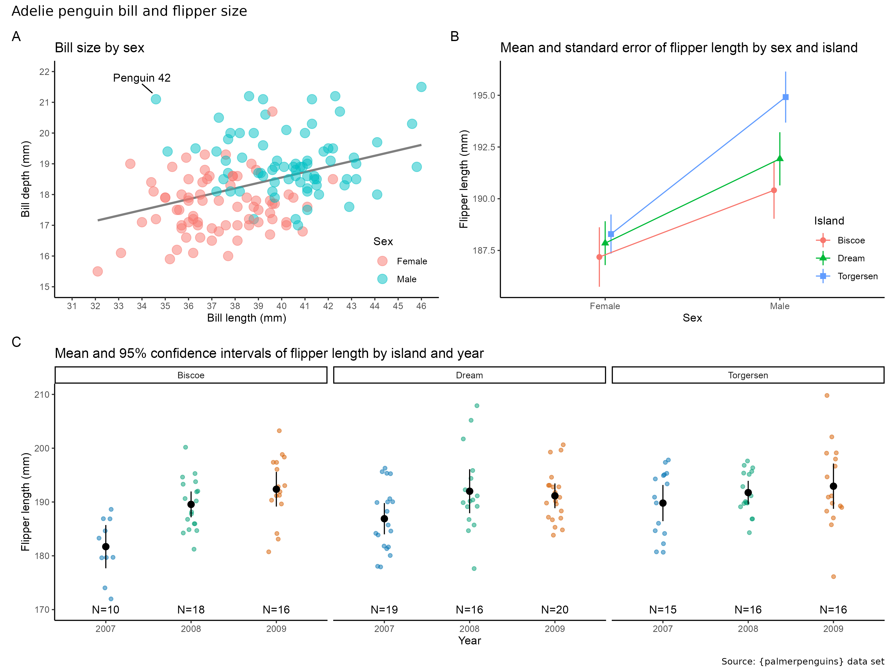

Recreate the following plot. Don't worry about exact locations, size, or scaling. But pay attention to subsetting of the data and capitalization of text. Feel free to write the code in an R script or R Markdown document. Upload your final code to Canvas under _Exercise: Plotting challenge_ by May 3.

