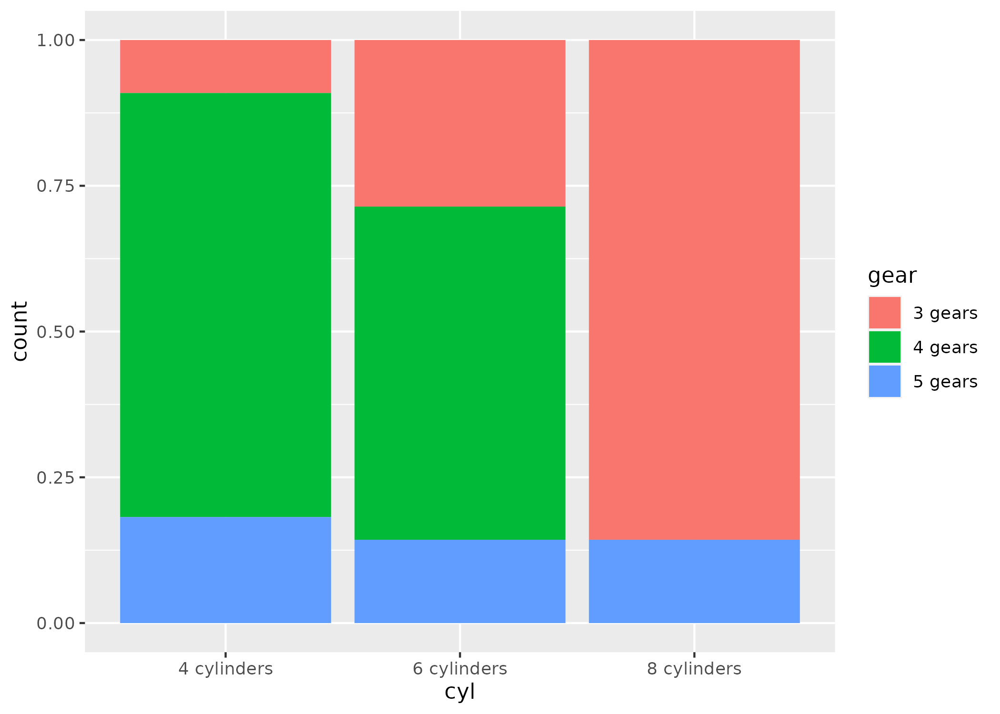

1. Using the `mtcars` data, create a barchart of the counts for each level of cylinder.

```{r}
library(tidyverse)
mtcars |> 
  mutate(cyl = as.factor(cyl),
         gear = as.factor(gear)) |> 
  ggplot(aes(x = cyl)) +
  geom_bar()
```

2. Repeat the barchart but stack the counts by gear.

```{r}
mtcars |> 
  mutate(cyl = as.factor(cyl),
         gear = as.factor(gear)) |> 
  ggplot(aes(x = cyl, fill = gear)) +
  geom_bar()
```

3. Recreate this plot:



```{r}
mtcars |>
  mutate(cyl = as.factor(cyl),
         cyl = str_c(cyl, " cylinders"),
         gear = as.factor(gear),
         gear = str_c(gear, " gears")) |>
  ggplot(aes(x = cyl, fill = gear)) +
  geom_bar(position = "fill")

```

4. Repeat barchart #2 but set the position to "dodge".

```{r}
mtcars |> 
  mutate(cyl = as.factor(cyl),
         gear = as.factor(gear)) |> 
  ggplot(aes(x = cyl, fill = gear)) +
  geom_bar(position = "dodge")
```

5. Whoa, what happened to 8 cylinders? Unfortunately, since there were only two levels of gear for 8 cylinders, it just split the bars in two. To hold the numbers of bars the same across all levels, you can set position to `position_dodge(preserve = "single")`. Try that.

```{r}
mtcars |> 
  mutate(cyl = as.factor(cyl),
         gear = as.factor(gear)) |> 
  ggplot(aes(x = cyl, fill = gear)) +
  geom_bar(position = position_dodge(preserve = "single"))
```

6. Well, that's better---the two bars are the same width as all of the other bars. But the 4 gears should show up as 0. To fix, we need to count the data first, find implicitly missing data, and plot using `geom_col()`. So first, find counts for the combinations of cylinders and gears. Then use `complete()` to find the implicitly missing combinations. Then replace the NAs with 0s. Then use `geom_col()` to plot these values with the position dodged.

```{r}
mtcars |> 
  mutate(cyl = as.factor(cyl),
         gear = as.factor(gear)) |> 
  count(cyl, gear) |> 
  complete(cyl, gear) |> 
  mutate(n = as.numeric(str_replace_na(n, "0"))) |> 
  ggplot(aes(x = cyl, y = n, fill = gear)) +
  geom_col(position = position_dodge())
```

7. Make a dotplot of the counts for each level of carb and plot carb on the y-axis and the count on the x-axis. Reminder that first you'll need to count the observations in each level of carb before starting the plot.

```{r}
mtcars |> 
  count(carb) |> 
  ggplot(aes(x = carb, y = n)) +
  geom_point() +
  coord_flip()
```


8. Repeat dotplot #8 but order carb based on the counts from highest to lowest count.

```{r}
mtcars |> 
  count(carb) |> 
  ggplot(aes(x = fct_reorder(as.factor(carb), n), y = n)) +
  geom_point() +
  coord_flip()
```

