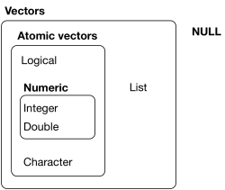

```{r setup, include=FALSE}
library(learnr)
gradethis::gradethis_setup()
knitr::opts_chunk$set(echo = FALSE)
```


## Combining data elements

Data types refer to individual elements of information. Those elements combine into different _data structures_. Technically, all elements of information (even individual ones) in R are _vectors_, and there are different forms of vectors.



_Atomic vectors_ are **homogeneous** meaning that they contain a single data type. _Lists_ are **heterogenous** meaning that they can contain multiple data types. We will refer to one dimensional atomic vectors as _vectors_. In terms of lists, we will primarily work with _data frames_ or rectangular lists. _Tibbles_ are special forms of data frames.

## Vectors

Vectors can include numeric, character, or logical data, but they can only contain a single data type. The simplest way to create a vector is by using the `c()` function.

**Create a vector called `cast` that includes the words _Kenan_, _Punkie_, and _Molly_ in that order.**
```{r exercise4, exercise = TRUE}

```
 
```{r exercise4-solution}
cast <- c("Kenan", "Punkie", "Molly")
```

```{r exercise4-code-check}
grade_code()
```

**Combine the vectors `weekdays` and `weekend` to create a new vector called `week` that starts with _Monday_.**

```{r exercise5, exercise = TRUE}
weekdays <- c("Monday", "Tuesday", "Wednesday", "Thursday", "Friday")
weekend <- c("Saturday", "Sunday")
```
 
```{r exercise5-solution}
weekdays <- c("Monday", "Tuesday", "Wednesday", "Thursday", "Friday")
weekend <- c("Saturday", "Sunday")
week <- c(weekdays, weekend)
```

```{r exercise5-code-check}
grade_code()
```


```{r vectors-quiz}
question(
  'If you combined vector `c(TRUE, TRUE, FALSE)` with `c("FALSE", "TRUE", "FALSE")`, what type of vector would you produce?',
  answer('Character', correct = TRUE),
  answer('Logical', message = "Oops, this would generate an ordered list."),
  answer('Mixed character/logical'),
  answer('This would fail to produce a combined vector'),
  allow_retry = TRUE,
  random_answer_order = TRUE
)
```


## Sequences

We can create sequences of numbers with `seq()` or `:`. To get quartiles, run `seq(from = 0, to = 100, by = 25)`. To get 1, 2, 3, run `1:3`. Give these examples a try.


**Write the code to produce a sequence from 0 to 1 in increments of 0.05 (include all argument names).**
```{r exercise6, exercise = TRUE}

```
 
```{r exercise6-solution}
seq(from = 0, to = 1, by = 0.05)
```

```{r exercise6-code-check}
grade_code()
```


**Write the code to produce a sequence from 10 to 0 in increments first using `seq()` (include all argument names) then using `:`. Replace the `_` with your answers.**
```{r exercise7, exercise = TRUE}
seq(from = _, to = _, by = _)
_:_
```
 
```{r exercise7-solution}
seq(from = 10, to = 0, by = -1)
10:0
```

```{r exercise7-code-check}
grade_code()
```


## Repetitions

Sometimes, you need to create a repetition of values, e.g., when creating a column of experimental conditions. You can use the `rep()` function to either repeat single values or vectors of values. Vectors can be repeated either as a whole vector (`times` argument) or each element of the vector can be repeated (`each` argument).

```{r echo = TRUE}
conditions <- c("Control", "Treatment A", "Treatment B")
rep(conditions, times = 3)
rep(conditions, each = 3)
```


**Repeat the entire `myvector` 10 times.**
```{r exercise8, exercise = TRUE}
myvector <- 1:5
  
```
 
```{r exercise8-solution}
myvector <- 1:5
rep(myvector, times = 10)
```

```{r exercise8-code-check}
grade_code()
```


**Repeat each element of the `myvector` 10 times.**
```{r exercise9, exercise = TRUE}
myvector <- 1:5
  
```
 
```{r exercise9-solution}
myvector <- 1:5
rep(myvector, each = 10)
```

```{r exercise9-code-check}
grade_code()
```

## Dimensions

We can use `length()` to find the length of a vector and `dim()` to get the dimensions of a data frame. We can also use `nrow()` and `ncol()` to get the number of rows and columns (respectively) for data frames.

```{r dimensions}
question("Test each of these and select which ones find the number of _rows_ for the `mtcars` dataset?",
         answer("`dim(mtcars)[1]`", correct = TRUE),
         answer("`nrow(mtcars)`", correct = TRUE),
         answer("`length(mtcars$mpg)`", correct = TRUE),
         answer("`length(mtcars[, 1])`", correct = TRUE),
         answer('`length(mtcars[1, ])`'),
         answer('`dim(mtcars)[2]`'),
         answer("`length(mtcars)`"),
         allow_retry = TRUE,
         random_answer_order = TRUE
)
```


## Indexing

Extracting subsets of vector or data frame elements involves using the index operator `[]`. For data frames, the first number represents the row and the second represents the column. For instance, `mydf[2, 7]` extracts the value from the second row and the seventh column. To extract vectors, use sequences or vectors to subset multiple rows and/or columns: `mydf[1:2, c(3, 4, 7)]`. Leave the row or column empty to select the entire row or column: `mydf[, 2]`.

Here, we create a data frame.
```{r echo = TRUE}
mydf <- data.frame(matrix(1:25, ncol = 5))
names(mydf) <- letters[1:5]
mydf
```

```{r markdown-quiz}
quiz(
question(
  'Which of the following would subset the value 12?',
  answer('`mydf[2, 3]`', correct = TRUE),
  answer('`mydf[3, 2]`', message = "Oops, that reversed row and column."),
  answer('`mydf[2, c]`', message = "Oops, you can't use `c` in this notation."),
  answer('`mydf[c, 2]`', message = "Oops, you can't use `c` in this notation."),
  allow_retry = TRUE,
  random_answer_order = TRUE
),
question_text(
  "Write the code that subsets the matrix of numbers 2-4, 7-9, and 12-14 by indexing the rows and columns.",
  answer('mydf[2:4, 1:3]', correct = TRUE),
  answer('mydf[1:3, 2:4]', message = "Oops, that reversed rows and columns."),
  answer('c(mydf[2:4, 1], mydf[2:4, 2], mydf[2:4, 3])', message = "Oops, that created a vector instead of a matrix."),
  answer('c(mydf$a[2:4], mydf$b[2:4], mydf$c[2:4])', message = "Oops, that created a vector instead of a matrix."),
  allow_retry = TRUE
),
question(
  'Try all of these out and select which of the following would subset the entire fourth column?',
  answer('`mydf$d`', correct = TRUE),
  answer('`mydf[, 4]`', correct = TRUE),
  answer('`mydf[1:5, 4]`', correct = TRUE),
  answer('`mydf[[4]]`', correct = TRUE),
  answer('`mydf[4, ]`', message = "Oops, this subsets the fourth row."),
  allow_retry = TRUE,
  random_answer_order = TRUE
),
question(
  'Which of the following would be the *best* way to subset the entire fourth column?',
  answer('`mydf$d`', correct = TRUE),
  answer('`mydf[4, ]`', message = "Oops, this subsets the fourth row."),
  answer('`mydf[, 4]`', message = "While this does subset the fourth column, it uses numbers to do so."),
  answer('`mydf[1:5, 4]`', message = "While this does subset the fourth column, it uses numbers to do so."),
  answer('`mydf[[4]]`', message = "While this does subset the fourth column, it uses numbers to do so."),
  allow_retry = TRUE,
  random_answer_order = TRUE
)
)
```

### 

### Wrap-up

Congratulations, you finished the tutorial!

To get credit for this assignment, replace my name with the first name that you submitted in the course introduction form in the code below and click *Run Code* to generate the text for you to submit to Canvas. 

```{r exit_function}
letter_nums <- letters[1:26]
generate_text <- function(x) {
  x <- tolower(x)
  offset <- 8
  if (!is.character(x)) stop("Oops! Did you surround your name with quotation marks?")
  if (x == "jeff") stop("Oops! You left my name in. Please type your name.")
  x <- stringr::str_sub(x, 1, 4)
  expanded <- stringr::str_split_fixed(x, "", 4)
  name_nums <- match(expanded, letter_nums)
  name_nums <- name_nums[!is.na(name_nums)]
  new_nums <- as.character(name_nums + offset)
  new_text <- paste("Now copy this string of numbers and submit them to Canvas:", stringr::str_c(new_nums, collapse = ""))
  return(new_text)
}
```

```{r exit_code, exercise = TRUE, exercise.setup = "exit_function"}
# replace my name below with your first name (surrounded by quotes)
first_name <- "Jeff"
generate_text(first_name)
```

### Assignment complete!

Great! Copy that code into Canvas, and you're all set for this tutorial.
