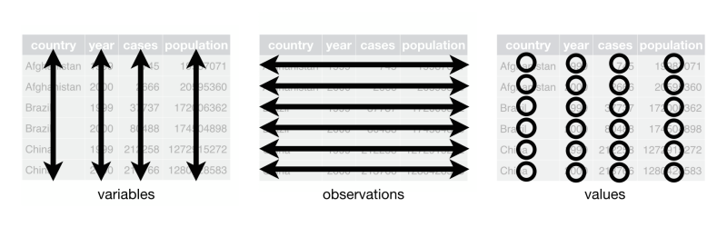
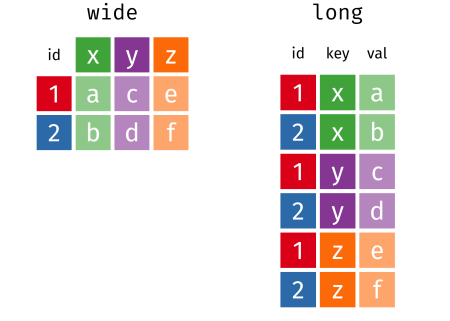

```{r setup, include=FALSE}
library(learnr)
library(tidyverse)
library(palmerpenguins)
options(tutorial.max.forked.procs = 10)
gradethis::gradethis_setup()
knitr::opts_chunk$set(echo = FALSE)
penguins3 <- penguins |> 
  select(-flipper_length_mm, -body_mass_g, -year) |> 
  mutate(id = 1:nrow(penguins), .before = species)
penguins1 <- penguins3 |> 
  unite(bill_area, bill_length_mm, bill_depth_mm, sep = "x")
penguins2 <- penguins3 |> 
  pivot_longer(contains("bill_"), names_to = "measurement", values_to = "size")
```


## Tidy data

### Set-up

For this exercise, we'll use functions from the `{tidyr}` and `{dplyr}` packages, so let's load those as well as the `{palmerpenguins}` package for example data.

```{r echo = TRUE, message = FALSE}
library(tidyr)
library(dplyr)
library(palmerpenguins)
```

###

**Tidy data** refers to a specific format of data (not just being 'clean'). Tidy data meet the following criteria:

1. Each variable must have its own column.
1. Each observation must have its own row.
1. Each value must have its own cell.



Sometimes your data may already be 'tidy'. But sometimes you may have to reshape your data to make it tidy. 

###

Here are three data sets.

```{r echo = TRUE}
head(penguins1)
head(penguins2)
head(penguins3)
```

```{r tidy-data}
question(
  'Which of these data sets is tidy data?',
  answer('`penguin3`', correct = TRUE),
  answer('`penguin2`', message = "Each row is not a single observation"),
  answer('`penguin1`', message = "Each cell does not have a single value"),
  answer('None of them'),
  allow_retry = TRUE,
  random_answer_order = TRUE
)
```


## Pivoting data

### 

There are numerous packages and functions that help you reshape data. Most of them are confusing, and it is difficult to remember the syntax. The `{tidyr}` package helps with this by offering two easy-to-remember functions that reshape data. Previously, they were termed `gather()` and `spread()`, so you may see these functions referenced. But these functions have been superseded by the more memorable functions `pivot_longer()` and `pivot_wider()` that reshape your data into long or wide format.



### Wide vs. long data

It might be useful to think about repeated-measures data to understand wide vs. long format. For instance, in the `wide` data set below, there are four columns (`id`, `x`, `y`, `z`) and two rows. Let's imagine that columns `x`, `y`, and `z` represent three time points that we've measured something, say cortisol level. We have two participants (1 and 2), and the values of their cortisol levels are `a`, `c`, `e` for participant 1 and `b`, `d`, `f` for participant 2. Thus, the repeated measures are oriented as different columns.

```{r echo = FALSE}
wide <- tibble(id = 1:2, x = c("a", "b"), y = c("c", "d"), z = c("e", "f"))
long <- wide |> 
  pivot_longer(cols = x:z, names_to = "key", values_to = "val") |> 
  arrange(key)
```
```{r echo = TRUE}
wide
```

However, this same information can be stored in a different way. The `long` data set shows that the repeated measures can be stored vertically as rows rather than horizontally as columns. Here, we have the `id` variable again to signal participant, but now we have a `key` column that signals which repeated measure the row contains. Then we have a column `val` that has all of the response values.

```{r echo = TRUE}
long
```

Same information. Two different ways to store it.

```{r tidy-data2}
question(
  'Given the information presented, which of these data sets is tidy data?',
  answer('`long`', correct = TRUE),
  answer('`wide`'),
  answer('both'),
  answer('neither'),
  allow_retry = TRUE,
  random_answer_order = TRUE
)
```

## Pivot longer

### 

The `pivot_longer()` function takes wide data and makes it long. Therefore, it takes the column names for a set of columns and makes them a single column that acts as a 'key' for signalling the value column that is also generated. 
Here is the `wide` data set again:
```{r echo = TRUE}
wide
```

To make this longer, we need to take the column values for `x`, `y`, `z` and make a single column out of them. Then we need to match up the column names with the respective value. We can do this with the `pivot_longer()` function by specifying the columns that we want to pivot longer (it will just repeat the non-specified columns, e.g., `id`). Then we need to create new column names for both the key (using the `names_to` argument) and the values (using the `values_to` argument). For instance to make `wide` into `long`, we would use:

```{r echo = TRUE}
pivot_longer(wide, cols = x:z, names_to = "key", values_to = "val")
```

Notice that the row order is slightly different from the previous version of long. If we want to produce `long` in the previous order, how do we sort data frames by row?

```{r echo = TRUE}
long <- wide |> 
  pivot_longer(cols = x:z, names_to = "key", values_to = "val") |> 
  arrange(key)
long
```

### Pivot penguin data longer

Load the `{palmerpenguin}` package and view the `penguins` data set. Let's recreate the `penguins3` data frame that we saw before. To do this, you need to (1) remove the `flipper_length_mm`, `body_mass_g`, and `year` columns, (2) create a new `id` column that is just a vector of row numbers (from 1 to the number of rows) in the data frame and put it before the `species` column, and (3) assign this to `penguins3`. Then make that `id` column the first column of the data frame. **Note that you cannot remove and rearrange columns in the same select statement, so you'll need two separate statements.**

```{r exercise1, exercise = TRUE}
penguins3 <- penguins |> 
  select(...) |> 
  mutate(...)
penguins3
```
 
```{r exercise1-check}
grade_result(
  pass_if(~identical(.result, penguins3 <- penguins %>% 
  dplyr::select(-flipper_length_mm, -body_mass_g, -year) %>% 
  dplyr::mutate(id = 1:nrow(penguins), .before = species)))
)
```

###

Now that we have `penguins3`, we want to use `pivot_longer()` to produce `penguins2`. That is, we want to turn the `bill` columns vertically so that we have a column called `measurement` that takes the values `bill_length_mm` or `bill_depth_mm` and a column called `size` that includes the values. Use `pivot_longer()` to generate `penguins2`.

```{r exercise2, exercise = TRUE}
penguins2 <- penguins3 |> 
  pivot_longer(...)
penguins2
```
 
```{r exercise2-check}
grade_result(
  pass_if(~identical(.result, penguins2 <- penguins3 %>% 
  tidyr::pivot_longer(contains("bill_"), names_to = "measurement", values_to = "size")))
)
```


## Pivot wider

### 

The `pivot_wider()` function takes long data and makes it wide. So, it take a key column's labels and makes columns out of them then fills in the appropriate values.

Here is the `long` data:
```{r echo = TRUE}
long
```

To make this wider, we need to take the column `key` and divide it up into columns `x`, `y`, and `z`. Then we need to distribute the values in `val` to the appropriate new columns. We can do this with the `pivot_wider()` function by specifying the column to get the names from (using the `names_from` argument) and the column to get the values from (using the `values_from` argument). For instance to make `long` into `wide2`, we would use:

```{r echo = TRUE}
wide2 <- pivot_wider(long, id_cols = id, names_from = key, values_from = val)
wide2
```

Does this match the original `wide` data frame?

```{r}
wide
```

### Pivot penguin data wider

Let's turn the `penguins2` data set back to `penguins3` but rename it `penguins3a`. Here's the `penguins2` data set.

```{r}
penguins2
```

We want to use the `measurement`  column for new column names and `size` for values.

```{r exercise3, exercise = TRUE}
penguins3a <- penguins2 |> 
  pivot_wider(...)
penguins3a
```
 
```{r exercise3-check}
grade_result(
  pass_if(~identical(.result, penguins3a <- penguins2 %>% 
  tidyr::pivot_wider(names_from = "measurement", values_from = "size")))
)
```

### Wrap-up

Congratulations, you finished the tutorial!

To get credit for this assignment, replace my name with the first name that you submitted in the course introduction form in the code below and click *Run Code* to generate the text for you to submit to Canvas. 

```{r exit_function}
letter_nums <- letters[1:26]
generate_text <- function(x) {
  x <- tolower(x)
  offset <- 23
  if (!is.character(x)) stop("Oops! Did you surround your name with quotation marks?")
  if (x == "jeff") stop("Oops! You left my name in. Please type your name.")
  x <- stringr::str_sub(x, 1, 4)
  expanded <- stringr::str_split_fixed(x, "", 4)
  name_nums <- match(expanded, letter_nums)
  name_nums <- name_nums[!is.na(name_nums)]
  new_nums <- as.character(name_nums + offset)
  new_text <- paste("Now copy this string of numbers and submit them to Canvas:", stringr::str_c(new_nums, collapse = ""))
  return(new_text)
}
```

```{r exit_code, exercise = TRUE, exercise.setup = "exit_function"}
# replace my name below with your first name (surrounded by quotes)
first_name <- "Jeff"
generate_text(first_name)
```

### Assignment complete!

Great! Copy that code into Canvas, and you're all set for this tutorial.
