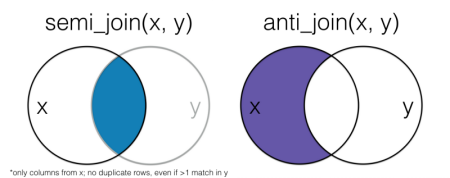

```{r setup, include=FALSE}
library(learnr)
library(tidyverse)
library(nycflights13)
options(tutorial.max.forked.procs = 10)
gradethis::gradethis_setup()
knitr::opts_chunk$set(echo = FALSE)
set.seed(3)
flights2 <- select(flights, carrier, flight, origin, dest) |> 
    slice_sample(n = 5)
flights14 <- flights |> 
  slice_sample(n = 5) |>   # grab 5 random rows
  select(carrier, flight, origin, dest) |>   # select the columns that we want
  mutate(year = 2014)  # change the year to 2014
airlines2 <- rename(airlines, airline = carrier)
flights1314 <- bind_rows(flights2, flights14)
id <- 1:nrow(flights1314)
```


## Filtering joins

###

Filtering joins merge rows. Semi joins (`semi_join()`) keep all observations that match the base data frame. Anti joins (`anti_join()`) exclude observations in the base data frame. In both cases, the first data frame passed to the function is what is filtered, and the second data frame provides the elements that should be filtered.

<center>

</center>


### Questions

Here are two data frames:
```{r}
x <- tribble(
  ~key, ~val_x,
     1, "x1",
     2, "x2",
     3, "x3",
     4, "x4"
)
y <- tribble(
  ~key, ~val_y,
     1, "y1",
     2, "y2",
     4, "y4",
     5, "y5"
)
```
```{r echo = TRUE}
x
y
```

**Which type of join would produce the following data frame?**
```{r, message = FALSE}
z <- anti_join(x, y, by = "key")
z
```

```{r anti-join}
question(
  "",
  answer('`anti_join(x, y, by = "key")`', correct = TRUE),
  answer('`left_join(x, y, by = "key")`'),
  answer('`semi_join(y, x, by = "key")`'),
  answer('`full_join(y, x, by = "key")`'),
  allow_retry = TRUE,
  random_answer_order = TRUE
)
```

**Which type of join would produce the following data frame?**
```{r, message = FALSE}
z <- semi_join(y, x, by = "key")
z
```

```{r semi-join}
question(
  "",
  answer('`anti_join(x, y, by = "key")`'),
  answer('`left_join(y, x, by = "key")`'),
  answer('`semi_join(y, x, by = "key")`', correct = TRUE),
  answer('`full_join(x, y, by = "key")`'),
  allow_retry = TRUE,
  random_answer_order = TRUE
)
```

## Merging flight data

###

We're going to work with the `nycflights13` data sets again.

```{r echo = TRUE, message = FALSE}
library(nycflights13)
library(dplyr)
```

I created a subsample of the `flights` data set called `flights2` with only 5 observations.

```{r}
flights2
```

And let's remind ourselves what the `airlines` data set looks like.

```{r}
airlines
```

###

**1. How can we filter the `airlines` data set to only show the carriers included in `flights2`?**

```{r exercise1, exercise = TRUE}
???_join(...)
```
 
```{r exercise1-solution}
semi_join(airlines, flights2, by = "carrier")
```

```{r exercise1-check}
grade_result(
  pass_if(~identical(.result, semi_join(airlines, flights2, by = "carrier")))
)
```

###

**2. How can we filter the `airlines` data set to _exclude_ the carriers included in `flights2`?**

```{r exercise2, exercise = TRUE}
???_join(...)
```
 
```{r exercise2-solution}
anti_join(airlines, flights2, by = "carrier")
```

```{r exercise2-check}
grade_result(
  pass_if(~identical(.result, anti_join(airlines, flights2, by = "carrier")))
)
```

###

Now let's imagine that an `airlines2` data set used _airline_ instead of _carrier_ to name that column.

```{r echo = TRUE}
airlines2
```

**3. How do we filter the `airlines2` data set to _exclude_ the carriers included in `flights2`?**

```{r exercise3, exercise = TRUE}
anti_join(airlines2, flights2, ...)
```
 
```{r exercise3-solution}
anti_join(airlines2, flights2, by = join_by(airline == carrier))
```

```{r exercise3-check}
grade_result(
  pass_if(~identical(.result, anti_join(airlines2, flights2, by = join_by(airline == carrier))))
)
```


## Adding rows and columns

###

Let's say we have some data from 2014 that we want to add to the bottom of `flights2`. How would we do that? Here's the new data (`flights14`):

```{r}
flights14
```

**4. Would we use `bind_rows()` or `bind_cols()` to add `flights14` to the bottom of `flights2`? Type the code that would combine `flights2` and `flights14` to create an object called `flights1314`.**

```{r exercise4, exercise = TRUE}
(flights1314 <- bind_???(...))
```
 
```{r exercise4-solution}
flights1314 <- bind_rows(flights2, flights14)
```

```{r exercise4-check}
grade_result(
  pass_if(~identical(.result, flights1314 <- bind_rows(flights2, flights14)))
)
```

###

**5. Now create a vector called `id` that is a sequence from 1 to the number of rows in `flights1314` and bind it as the first column of `flights1314` (ensuring the new column is named `id`).**

```{r exercise5, exercise = TRUE}
id <- ...
bind_???(...)
```
 
```{r exercise5-solution}
id <- 1:nrow(flights1314)
bind_cols(id = id, flights1314)
```

```{r exercise5-check}
grade_result(
  pass_if(~identical(.result, bind_cols(id = id, flights1314)))
)
```

### Wrap-up

Congratulations, you finished the tutorial!

To get credit for this assignment, replace my name with the first name that you submitted in the course introduction form in the code below and click *Run Code* to generate the text for you to submit to Canvas. 

```{r exit_function}
letter_nums <- letters[1:26]
generate_text <- function(x) {
  x <- tolower(x)
  offset <- 20
  if (!is.character(x)) stop("Oops! Did you surround your name with quotation marks?")
  if (x == "jeff") stop("Oops! You left my name in. Please type your name.")
  x <- stringr::str_sub(x, 1, 4)
  expanded <- stringr::str_split_fixed(x, "", 4)
  name_nums <- match(expanded, letter_nums)
  name_nums <- name_nums[!is.na(name_nums)]
  new_nums <- as.character(name_nums + offset)
  new_text <- paste("Now copy this string of numbers and submit them to Canvas:", stringr::str_c(new_nums, collapse = ""))
  return(new_text)
}
```

```{r exit_code, exercise = TRUE, exercise.setup = "exit_function"}
# replace my name below with your first name (surrounded by quotes)
first_name <- "Jeff"
generate_text(first_name)
```

### Assignment complete!

Great! Copy that code into Canvas, and you're all set for this tutorial.
